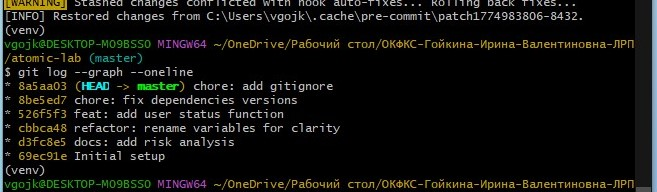
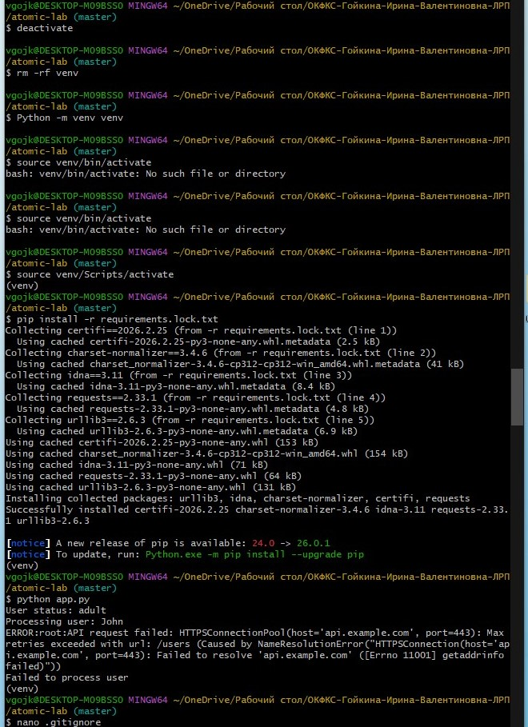
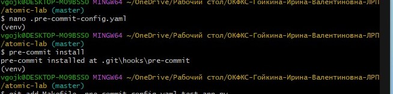

# Практическая работа

Выполнила: Гойкина Ирина Валентиновна

## Демонстрация атомарности
История коммитов показывает атомарные изменения, где каждый коммит решает одну задачу:



## Воспроизводимость окружения («чистый старт»)
Процесс восстановления виртуального окружения из lock-файла:



api.example.com - это вымышленный адрес для примера.
Работает функция get_user_status (вывелось "User status: adult")
Работает обработка ошибок (перехватывает исключение API)
Логирование работает (вывелось ERROR:root:API request failed...)

## Pre-commit hooks
Pre-commit хук блокирует коммит при нарушении стиля кода:



## Контрольные вопросы
### 1. Как использование git add -p помогает при отладке через git bisect?

`git add -p` позволяет создавать атомарные коммиты, где каждое изменение решает одну задачу. При использовании `git bisect` для поиска бага, если коммиты атомарные, `bisect` точно укажет на конкретный коммит, который ввел баг. Если бы в коммите были смешаны разные изменения, было бы непонятно, какое именно изменение вызвало проблему, и пришлось бы вручную анализировать большой коммит.

### 2. Почему наличие requirements.lock.txt критично для командной работы?

`requirements.lock.txt` фиксирует точные версии всех зависимостей, включая подзависимости. Это обеспечивает:
- **Идентичность окружений**: все разработчики используют одинаковые версии пакетов
- **Предсказуемость**: приложение работает одинаково на всех машинах
- **Исключение конфликтов**: версии не обновляются автоматически, что могло бы сломать совместимость
- **Воспроизводимость деплоя**: production окружение точно соответствует dev

### 3. В чем преимущество Makefile перед текстовой инструкцией в README?

Makefile:
- **Исполняемая документация**: команды не нужно копировать и вставлять
- **Автоматизация**: сложные процессы выполняются одной командой (`make test`, `make run`)
- **Стандартизация**: все разработчики используют одинаковые команды
- **Самодокументируемость**: цели имеют понятные имена
- **Изоляция**: можно определить цели для разных окружений (dev, prod, test)

### 4. Как тесты реализуют принцип «живой документации»?

Тесты демонстрируют, как должен использоваться код, и какие результаты ожидаются. Структура Given-When-Then делает тесты читаемыми как спецификация. Использование моков (mock) важно для:
- **Детерминированности**: тесты всегда выполняются одинаково
- **Воспроизводимости**: любой разработчик получит тот же результат
- **Отладки**: баги, связанные с внешними сервисами, легко воспроизвести
- **Стабильности CI/CD**: тесты не "падают" случайно из-за недоступности внешних API

### 5. Что произойдет, если удалить папку venv и выполнить make install на чистой машине?

При выполнении `make install`:
1. Создается новое виртуальное окружение
2. Устанавливаются все зависимости из `requirements.lock.txt` с точными версиями
3. Окружение полностью восстанавливается в исходное состояние
4. Приложение будет работать идентично предыдущим запускам

Это демонстрирует полную воспроизводимость окружения без необходимости ручной настройки.

## Как запустить проект

```bash
# Клонировать репозиторий
git clone <url>

# Установить зависимости и настроить окружение
make install

# Запустить тесты
make test

# Запустить приложение
make run

# Проверить стиль кода
make lint
